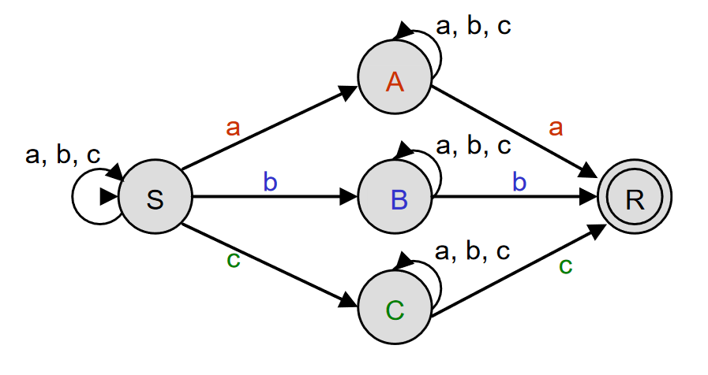
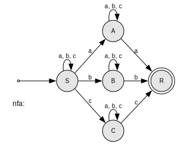
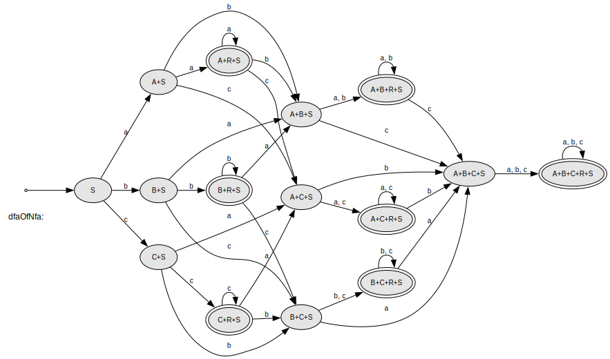
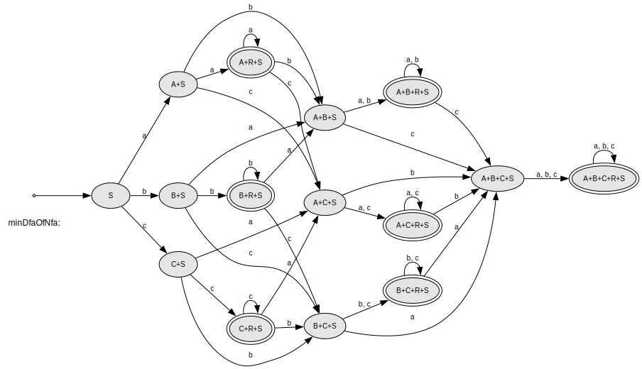

VNt = { 1, 2, 3, 4 }, deletable: {  }
VT  = { a, b }
```

<div style="page-break-after: always;"></div>

# Aufgabe 2

## a)

### Implementation

```c++
    FABuilder builder;
    builder.setStartState("B")
            .addFinalState("R")
            .addTransition("B", 'b', "R")
            .addTransition("R", 'b', "R")
            .addTransition("R", 'z', "R");

    const unique_ptr<DFA> dfa(builder.buildDFA());

    cout << "dfa:" << endl << *dfa;
    vizualizeFA("dfa", dfa.get());

    auto testInput = [&](const string &input) {
        cout << "dfa->accepts(\"" << input << "\") => ";
        if (dfa->accepts(input)) {
            cout << " (accepted)" << endl;
        } else {
            cout << " (rejected)" << endl;
        }
    };

    testInput("b");
    testInput("bzb");
    testInput("bbb");
    testInput("bbzbb");
    testInput("bzzb");
    testInput("z");
    testInput("bbba");
```

### Result

```c++
dfa->accepts("b") =>  (accepted)
dfa->accepts("bzb") =>  (accepted)
dfa->accepts("bbb") =>  (accepted)
dfa->accepts("bbzbb") =>  (accepted)
dfa->accepts("bzzb") =>  (accepted)
dfa->accepts("z") =>  (rejected)
dfa->accepts("bbba") =>  (rejected)
```

## b)

Ein Mealy-Automat ist für diese Aufgabe wahrscheinlich besser geeignet als ein Moore-Automat, da er die Ausgaben
basierend auf der aktuellen Kombination aus Zustand und Eingabesymbol generiert. Auf diese Weise kann auch das
Bandsymbol in die Übersetzung mit einbezogen werden. Ein Moore-Automat müsste für jede Ausgabe einen eigenen Zustand
definieren, was zu einem größeren Automaten mit höherer Komplexität führen würde.

### Implementierung eines Mealy-Automaten

Der Konstruktor eines Mealy-Automaten initialisiert den Automaten mit einer Lambda-Funktion, die die Ausgaben direkt
abhängig von der Kombination aus aktuellem Zustand und Eingabesymbol definiert.

Die `accepts`-Methode überprüft, ob eine Eingabe akzeptiert wird, indem sie Ausgaben nicht nur vom Zustand,
sondern auch vom gerade gelesenen `TapeSymbol` ableiten können. Die Methode liest das aktuelle `TapeSymbol` und bestimmt
die entsprechende Ausgabe anhand der Lambda-Funktion. Dann geht sie zum nächsten Zustand über, der durch die
Übergangsfunktion definiert ist.

```c++
MealyDFA::MealyDFA(const StateSet &S, const TapeSymbolSet &V,
         const State &s1, const StateSet &F,
         const DDelta &delta,
         const map<pair<State, TapeSymbol>, char> &mealyLambda)
    : DFA(S, V, s1, F, delta), lambda(mealyLambda) {
}

bool MealyDFA::accepts(const Tape &tape) const {
    int i = 0;
    TapeSymbol tSy = tape[i];
    State s = s1;

    std::cout << lambda.at(make_pair(s, tSy));

    while (tSy != eot) {
        s = delta[s][tSy];

        if (!defined(s)) {
            return false;
        }

        i++;
        tSy = tape[i];

        if (tSy != eot) {
            std::cout << lambda.at(make_pair(s, tSy));
        }
    }

    return F.contains(s);
}
```

### Erweiterung des FABuilders

Die Methode `setMealyLambda` erlaubt das Festlegen von Paaren aus Zuständen und Symbolen und den dazugehörigen
Ausgabesymbolen. Sie stellt außerdem sicher, dass die Zustände und Symbole im Automaten gültig sind. Die Methode
`buildMealyDFA` erzeugt eine Instanz eines `MealyDFA` und prüft dabei, ob die Lambda-Funktion definiert ist und der
Automat
deterministisch ist.

```c++
FABuilder &FABuilder::setMealyLambda(const std::initializer_list<std::pair<std::pair<State, TapeSymbol>, char> > il) {
    for (const auto &[key, value]: il) {
        const auto &stateSymbolPair = key;
        const State &state = stateSymbolPair.first;
        const TapeSymbol &symbol = stateSymbolPair.second;
        const char &output = value;

        if (S.find(state) == S.end()) {
            throw runtime_error("State " + state + " not found in the automaton");
        }

        if (V.find(symbol) == V.end()) {
            throw runtime_error("Symbol " + string(1, symbol) + " not found in the alphabet");
        }

        mealyLambda[stateSymbolPair] = output;
    }

    return *this;
}

MealyDFA *FABuilder::buildMealyDFA() const {
    if (mealyLambda.empty())
        throw domain_error("cannot build MealyDFA, no lambda function set");
    if (!representsDFA())
        throw domain_error("cannot build DFA, builder's delta represents a NFA");
    checkStates();
    return new MealyDFA(S, V, s1, F, dDeltaOf(delta), mealyLambda);
}
```

### Test

```c++
    FABuilder builder;

    builder.setStartState("B")
            .addFinalState("R")
            .addTransition("B", 'b', "R")
            .addTransition("R", 'b', "R")
            .addTransition("R", 'z', "R")
            .setMealyLambda({
                {{"B", 'b'}, 'c'},
                {{"B", 'z'}, 'd'},
                {{"R", 'b'}, 'c'},
                {{"R", 'z'}, 'd'}
            });

    const std::unique_ptr<MealyDFA> mealyDfa(builder.buildMealyDFA());

    std::cout << "Eingabeband: bzzb" << std::endl;
    std::cout << "Ausgabeband: ";

    if (mealyDfa->accepts("bzzb")) {
        cout << endl;
        std::cout << "Eingabe akzeptiert!" << std::endl;
    } else {
        cout << endl;
        std::cout << "Eingabe nicht akzeptiert!" << std::endl;
    }

    cout << endl;
```

### Ergebnis

```c++
Eingabeband: bzzb
Ausgabeband: cddc
Eingabe akzeptiert!
```

<div style="page-break-after: always;"></div>

# Aufgabe 3

## a)

### `accepts1`

This method uses multithreading to simulate non-determinism. It spawns a new thread for each possible transition (
epsilon transitions or symbol transitions). If any thread reaches a final state at the end of the tape, a shared
accepted variable is set to true, protected by a mutex to ensure thread safety. All threads are joined before the
function completes. This method is computationally intensive but showcases parallel exploration of possible paths.

```c++
// NFA::accepts1: uses multithreading to simulate non-determinism
//--------------
static bool accepted;
static mutex mtx; // used to synchronize access to variable accepted

static void accept1(const NDelta &delta, const StateSet &F,
                    const State &s, const Tape &tape, int i) {
    vector<thread> tv; // thread vector
    for (const State &epsDest: delta[s][eps]) // eps. transitions
        tv.emplace_back(accept1, cref(delta), cref(F),
                        epsDest, tape, i);
    const TapeSymbol tSy = tape[i];
    if (tSy == eot && F.contains(s)) {
        // end of tape and s is final
        mtx.lock();
        accepted = true;
        mtx.unlock();
    } else
        for (const State &tSyDest: delta[s][tSy]) // symbol transitions
            tv.emplace_back(accept1, cref(delta), cref(F),
                            tSyDest, tape, i + 1);
    for (auto &t: tv)
        t.join(); // join thread t with current thread
}

bool NFA::accepts1(const Tape &tape) const {
    accepted = false;
    accept1(this->delta, this->F, this->s1, tape, 0); // normal call ...
    // ... within current thread
    return accepted;
}
```

<div style="page-break-after: always;"></div>

### `accepts2`

This method uses recursive backtracking to simulate non-determinism. Starting from the initial state, it recursively
explores all possible transitions (epsilon and symbol) along the tape. If any path reaches a final state at the end of
the tape, the function returns true. Otherwise, it backtracks and continues exploring other paths. This approach is
simpler and more memory-efficient than multithreading but can encounter stack overflow for deep recursion.

```c++
// NFA::accepts2: uses backtracking to simulate non-determinism
//--------------
bool NFA::accepts2(const Tape &tape) const {
    return accepts2(s1, tape, 0); // see below
}

bool NFA::accepts2(const State &s,
                   const Tape &tape, int i) const {
    for (const State &epsDest: delta[s][eps]) // eps transitions
        if (accepts2(epsDest, tape, i)) // recursive call
            return true;
    TapeSymbol tSy = tape[i];
    if (tSy == eot)
        return F.contains(s); // accepted <==> s is final
    for (const State &tSyDest: delta[s][tSy]) // symbol transitions
        if (accepts2(tSyDest, tape, i + 1)) // recursive call
            return true;
    return false; // not accepted as no call succeeded
}
```

### `accepts3`

This method simulates non-determinism by tracing sets of states instead of exploring each path individually. Starting
from the epsilon closure of the initial state, it iteratively computes the set of all possible destination states for
each tape symbol. The process continues until the end of the tape. If the final set of states intersects with the set of
final states, the input is accepted.

```c++
// NFA::accepts3: tracing of state sets to simulate non-determinism
//--------------
bool NFA::accepts3(const Tape &tape) const {
    int i = 0; // index of first symbol
    TapeSymbol tSy = tape[i]; // fetch first symbol
    StateSet ss = epsClosureOf(StateSet(s1));

    while (tSy != eot) {
        // eot = end of tape
        StateSet dest = allDestsFor(ss, tSy);
        if (!defined(dest))
            return false; // undefined, so no acceptance
        ss = epsClosureOf(dest);
        i++;
        tSy = tape[i];
    }
    return !empty(ss ^ F); // accepted <==> (ss ^ F) != {}
}
```

### NFA Automaton

Aus dem gegebenen Automaten

<div style="text-align: center;">

<figcaption><i>Figure</i></figcaption>
</div>

lässt sich die folgende Implementierung ableiten:

```c++
    FABuilder builder;
    builder.setStartState("S")
            .addFinalState("R")
            .addTransition("S", 'a', "S")
            .addTransition("S", 'b', "S")
            .addTransition("S", 'c', "S")
            .addTransition("S", 'a', "A")
            .addTransition("S", 'b', "B")
            .addTransition("S", 'c', "C")
            .addTransition("A", 'a', "A")
            .addTransition("A", 'b', "A")
            .addTransition("A", 'c', "A")
            .addTransition("A", 'a', "R")
            .addTransition("B", 'a', "B")
            .addTransition("B", 'b', "B")
            .addTransition("B", 'c', "B")
            .addTransition("B", 'b', "R")
            .addTransition("C", 'a', "C")
            .addTransition("C", 'b', "C")
            .addTransition("C", 'c', "C")
            .addTransition("C", 'c', "R");

    const unique_ptr<NFA> nfa(builder.buildNFA());
```

wodurch folgender Automat entsteht:

```c++
nfa:
->    S -> a A | a S | b B | b S | c C | c S
      A -> a A | a R | b A | c A
      B -> a B | b B | b R | c B
      C -> a C | b C | c C | c R
   () R
```

<div style="text-align: center;">

<figcaption><i>Figure TODO: Visualized Automaton</i></figcaption>
</div>

### Tests

Um mehrere Testwerte effizient und konsistent zu testen, können wir eine Liste von Teststrings und eine
wiederverwendbare Lambda-Funktion `testMethod` definieren, um jede der akzeptierten Methoden auszuwerten.

Die Teststrings werden iteriert und die angegebene Methode wird auf jeden String angewendet, wobei auf der Konsole
ausgegeben wird, ob der NFA ihn akzeptiert oder ablehnt.

```c++
    vector<string> testStrings = {
        "a", "b", "c",
        "aa", "ab", "ac",
        "abc", "abca", "abcb", "abcc",
        "aaaabbbbcccc", "abcabcabcabc", "aabbccbbcca",
        "aaaaaaaa", "bbbbbbbb", "cccccccc",
        "d","xyz"
    };

    auto testMethod = [&](const string &methodName, auto acceptsMethod) {
        cout << "Testing " << methodName << ":" << endl;
        for (const auto &input: testStrings) {
            cout << "nfa->" << methodName << "(\"" << input << "\") =>";
            if (acceptsMethod(input)) {
                cout << " (accepted)" << endl;
            } else {
                cout << " (rejected)" << endl;
            }
        }
        cout << endl;
    };

    testMethod("accepts1", [&](const string &input) { return nfa->accepts1(input); });
    testMethod("accepts2", [&](const string &input) { return nfa->accepts2(input); });
    testMethod("accepts3", [&](const string &input) { return nfa->accepts3(input); });
```

<div style="page-break-after: always;"></div>

### Testergebnisse

```c++
Testing accepts1:
nfa->accepts1("a") => (rejected)
nfa->accepts1("ab") => (rejected)
nfa->accepts1("abc") => (rejected)
nfa->accepts1("abca") => (accepted)
nfa->accepts1("abcb") => (accepted)
nfa->accepts1("abcc") => (accepted)
nfa->accepts1("aaaabbbbcccc") => (accepted)
nfa->accepts1("abcabcabcabc") => (accepted)
nfa->accepts1("aabbccbbcca") => (accepted)
nfa->accepts1("aaaaaaaa") => (accepted)
nfa->accepts1("bbbbbbbb") => (accepted)
nfa->accepts1("cccccccc") => (accepted)
nfa->accepts1("xyz") => (rejected)
```

```c++
Testing accepts2:
nfa->accepts2("a") => (rejected)
nfa->accepts2("ab") => (rejected)
nfa->accepts2("abc") => (rejected)
nfa->accepts2("abca") => (accepted)
nfa->accepts2("abcb") => (accepted)
nfa->accepts2("abcc") => (accepted)
nfa->accepts2("aaaabbbbcccc") => (accepted)
nfa->accepts2("abcabcabcabc") => (accepted)
nfa->accepts2("aabbccbbcca") => (accepted)
nfa->accepts2("aaaaaaaa") => (accepted)
nfa->accepts2("bbbbbbbb") => (accepted)
nfa->accepts2("cccccccc") => (accepted)
nfa->accepts2("xyz") => (rejected)
```

```c++
Testing accepts3:
nfa->accepts3("a") => (rejected)
nfa->accepts3("ab") => (rejected)
nfa->accepts3("abc") => (rejected)
nfa->accepts3("abca") => (accepted)
nfa->accepts3("abcb") => (accepted)
nfa->accepts3("abcc") => (accepted)
nfa->accepts3("aaaabbbbcccc") => (accepted)
nfa->accepts3("abcabcabcabc") => (accepted)
nfa->accepts3("aabbccbbcca") => (accepted)
nfa->accepts3("aaaaaaaa") => (accepted)
nfa->accepts3("bbbbbbbb") => (accepted)
nfa->accepts3("cccccccc") => (accepted)
nfa->accepts3("xyz") => (rejected)
```

Wichtig ist, dass jede `accept`-Implementierung das gleiche Ergebnis für gleiche Teststrings liefert und die Ergebnisse
zwischen den getesteten Funktionen so konsistent untereinander ist.

## b)

Um die Performance der `accept`-Implementierungen zu vergleichen, habe ich meine `testFunction` so modifiziert, sodass
sie die Zeit jeder Auswertung erfasst:

```c++
    auto testMethod = [&](const string &methodName, auto acceptsMethod) {
        cout << "Testing " << methodName << ":" << endl;
        for (const auto &input: testStrings) {
            cout << "nfa->" << methodName << "(\"" << input << "\") =>";

            startTimer();
            const auto result = acceptsMethod(input);
            stopTimer();

            if (acceptsMethod(input)) {
                cout << " (accepted) - " << elapsedTime() << endl;
            } else {
                cout << " (rejected) - " << elapsedTime() << endl;
            }
        }
        cout << endl;
    };
```

Zunächst resultiert das in einem eher weniger aussagekräftigen Ergebnis:

```c++
Testing accepts1:
nfa->accepts1("a") => (rejected) - 0ms
nfa->accepts1("ab") => (rejected) - 0ms
nfa->accepts1("abc") => (rejected) - 0ms
nfa->accepts1("abca") => (accepted) - 0.001ms
nfa->accepts1("abcb") => (accepted) - 0ms
nfa->accepts1("abcc") => (accepted) - 0ms
nfa->accepts1("aaaabbbbcccc") => (accepted) - 0.006ms
nfa->accepts1("abcabcabcabc") => (accepted) - 0.005ms
nfa->accepts1("aabbccbbcca") => (accepted) - 0.004ms
nfa->accepts1("aaaaaaaa") => (accepted) - 0.003ms
nfa->accepts1("bbbbbbbb") => (accepted) - 0.003ms
nfa->accepts1("cccccccc") => (accepted) - 0.004ms
nfa->accepts1("xyz") => (rejected) - 0ms
```

```c++
Testing accepts2:
nfa->accepts2("a") => (rejected) - 0ms
nfa->accepts2("ab") => (rejected) - 0ms
nfa->accepts2("abc") => (rejected) - 0ms
nfa->accepts2("abca") => (accepted) - 0ms
nfa->accepts2("abcb") => (accepted) - 0ms
nfa->accepts2("abcc") => (accepted) - 0ms
nfa->accepts2("aaaabbbbcccc") => (accepted) - 0ms
nfa->accepts2("abcabcabcabc") => (accepted) - 0ms
nfa->accepts2("aabbccbbcca") => (accepted) - 0ms
nfa->accepts2("aaaaaaaa") => (accepted) - 0ms
nfa->accepts2("bbbbbbbb") => (accepted) - 0ms
nfa->accepts2("cccccccc") => (accepted) - 0ms
nfa->accepts2("xyz") => (rejected) - 0ms
```

```c++
Testing accepts3:
nfa->accepts3("a") => (rejected) - 0ms
nfa->accepts3("ab") => (rejected) - 0ms
nfa->accepts3("abc") => (rejected) - 0ms
nfa->accepts3("abca") => (accepted) - 0ms
nfa->accepts3("abcb") => (accepted) - 0ms
nfa->accepts3("abcc") => (accepted) - 0ms
nfa->accepts3("aaaabbbbcccc") => (accepted) - 0ms
nfa->accepts3("abcabcabcabc") => (accepted) - 0ms
nfa->accepts3("aabbccbbcca") => (accepted) - 0ms
nfa->accepts3("aaaaaaaa") => (accepted) - 0ms
nfa->accepts3("bbbbbbbb") => (accepted) - 0ms
nfa->accepts3("cccccccc") => (accepted) - 0ms
nfa->accepts3("xyz") => (rejected) - 0ms
```

Die Ausgabe schien auf Millisekunden-Niveau zu ungenau zu sein, um die Implementierungen miteinander vergleichen zu
können. Um dieses Problem zu lösen, habe ich zwei Varianten ausprobiert:

### Variante 1: Messgenauigkeit erhöhen auf Nanosekunden

Um die Messgenauikeit zu erhöhen, habe ich die Berechnung der vergangenen Zeit angepasst:

```c++
double elapsedTime() {
  return chrono::duration_cast<chrono::nanoseconds>(stop_tp - start_tp).count() / 1e6;
}
```

Das neue Ergebnis:

```c++
Testing accepts1:
nfa->accepts1("a") => (rejected) - 0.2695ms
nfa->accepts1("b") => (rejected) - 0.1893ms
nfa->accepts1("c") => (rejected) - 0.5607ms
nfa->accepts1("aa") => (accepted) - 0.4595ms
nfa->accepts1("ab") => (rejected) - 0.3732ms
nfa->accepts1("ac") => (rejected) - 0.3339ms
nfa->accepts1("abc") => (rejected) - 0.5803ms
nfa->accepts1("abca") => (accepted) - 0.8879ms
nfa->accepts1("abcb") => (accepted) - 0.8665ms
nfa->accepts1("abcc") => (accepted) - 0.896ms
nfa->accepts1("aaaabbbbcccc") => (accepted) - 6.3958ms
nfa->accepts1("abcabcabcabc") => (accepted) - 6.1135ms
nfa->accepts1("aabbccbbcca") => (accepted) - 5.2142ms
nfa->accepts1("aaaaaaaa") => (accepted) - 3.5449ms
nfa->accepts1("bbbbbbbb") => (accepted) - 3.7402ms
nfa->accepts1("cccccccc") => (accepted) - 3.8015ms
nfa->accepts1("d") => (rejected) - 0.0033ms
nfa->accepts1("xyz") => (rejected) - 0.0069ms
```

```c++
Testing accepts2:
nfa->accepts2("a") => (rejected) - 0.0109ms
nfa->accepts2("b") => (rejected) - 0.0086ms
nfa->accepts2("c") => (rejected) - 0.0097ms
nfa->accepts2("aa") => (accepted) - 0.0192ms
nfa->accepts2("ab") => (rejected) - 0.0173ms
nfa->accepts2("ac") => (rejected) - 0.0185ms
nfa->accepts2("abc") => (rejected) - 0.0136ms
nfa->accepts2("abca") => (accepted) - 0.0041ms
nfa->accepts2("abcb") => (accepted) - 0.0057ms
nfa->accepts2("abcc") => (accepted) - 0.0164ms
nfa->accepts2("aaaabbbbcccc") => (accepted) - 0.0396ms
nfa->accepts2("abcabcabcabc") => (accepted) - 0.0251ms
nfa->accepts2("aabbccbbcca") => (accepted) - 0.0064ms
nfa->accepts2("aaaaaaaa") => (accepted) - 0.011ms
nfa->accepts2("bbbbbbbb") => (accepted) - 0.0056ms
nfa->accepts2("cccccccc") => (accepted) - 0.0109ms
nfa->accepts2("d") => (rejected) - 0.0023ms
nfa->accepts2("xyz") => (rejected) - 0.0127ms
```

```c++
Testing accepts3:
nfa->accepts3("a") => (rejected) - 0.0546ms
nfa->accepts3("b") => (rejected) - 0.0516ms
nfa->accepts3("c") => (rejected) - 0.0383ms
nfa->accepts3("aa") => (accepted) - 0.023ms
nfa->accepts3("ab") => (rejected) - 0.0397ms
nfa->accepts3("ac") => (rejected) - 0.0465ms
nfa->accepts3("abc") => (rejected) - 0.0472ms
nfa->accepts3("abca") => (accepted) - 0.0443ms
nfa->accepts3("abcb") => (accepted) - 0.0476ms
nfa->accepts3("abcc") => (accepted) - 0.0507ms
nfa->accepts3("aaaabbbbcccc") => (accepted) - 0.0763ms
nfa->accepts3("abcabcabcabc") => (accepted) - 0.0861ms
nfa->accepts3("aabbccbbcca") => (accepted) - 0.131ms
nfa->accepts3("aaaaaaaa") => (accepted) - 0.0634ms
nfa->accepts3("bbbbbbbb") => (accepted) - 0.0476ms
nfa->accepts3("cccccccc") => (accepted) - 0.0464ms
nfa->accepts3("d") => (rejected) - 0.0388ms
nfa->accepts3("xyz") => (rejected) - 0.0248ms
```

Auf diese Weise sind die Werte vergleichbarer.

### Variante 2: Mehr iterationen pro Testwert

Dazu führe ich `accept` für jeden Testfall mehrfach aus, die Performance über viele Aufrufe hinweg zu vergleichen:

```c++
Testing accepts1:
nfa->accepts1("a") => - Time for 1000 iterations: 0.154ms
nfa->accepts1("b") => - Time for 1000 iterations: 0.136ms
nfa->accepts1("c") => - Time for 1000 iterations: 0.13ms
nfa->accepts1("aa") => - Time for 1000 iterations: 0.318ms
nfa->accepts1("ab") => - Time for 1000 iterations: 0.276ms
nfa->accepts1("ac") => - Time for 1000 iterations: 0.273ms
nfa->accepts1("abc") => - Time for 1000 iterations: 0.464ms
nfa->accepts1("abca") => - Time for 1000 iterations: 0.736ms
nfa->accepts1("abcb") => - Time for 1000 iterations: 0.737ms
nfa->accepts1("abcc") => - Time for 1000 iterations: 0.737ms
nfa->accepts1("aaaabbbbcccc") => - Time for 1000 iterations: 5.114ms
nfa->accepts1("abcabcabcabc") => - Time for 1000 iterations: 5.188ms
nfa->accepts1("aabbccbbcca") => - Time for 1000 iterations: 4.349ms
nfa->accepts1("aaaaaaaa") => - Time for 1000 iterations: 3.401ms
nfa->accepts1("bbbbbbbb") => - Time for 1000 iterations: 3.446ms
nfa->accepts1("cccccccc") => - Time for 1000 iterations: 3.353ms
nfa->accepts1("d") => - Time for 1000 iterations: 0ms
nfa->accepts1("xyz") => - Time for 1000 iterations: 0ms
```

```c++
Testing accepts2:
nfa->accepts2("a") => - Time for 1000 iterations: 0ms
nfa->accepts2("b") => - Time for 1000 iterations: 0ms
nfa->accepts2("c") => - Time for 1000 iterations: 0ms
nfa->accepts2("aa") => - Time for 1000 iterations: 0.001ms
nfa->accepts2("ab") => - Time for 1000 iterations: 0.001ms
nfa->accepts2("ac") => - Time for 1000 iterations: 0.001ms
nfa->accepts2("abc") => - Time for 1000 iterations: 0.003ms
nfa->accepts2("abca") => - Time for 1000 iterations: 0.001ms
nfa->accepts2("abcb") => - Time for 1000 iterations: 0.003ms
nfa->accepts2("abcc") => - Time for 1000 iterations: 0.004ms
nfa->accepts2("aaaabbbbcccc") => - Time for 1000 iterations: 0.029ms
nfa->accepts2("abcabcabcabc") => - Time for 1000 iterations: 0.013ms
nfa->accepts2("aabbccbbcca") => - Time for 1000 iterations: 0.003ms
nfa->accepts2("aaaaaaaa") => - Time for 1000 iterations: 0.002ms
nfa->accepts2("bbbbbbbb") => - Time for 1000 iterations: 0.002ms
nfa->accepts2("cccccccc") => - Time for 1000 iterations: 0.003ms
nfa->accepts2("d") => - Time for 1000 iterations: 0ms
nfa->accepts2("xyz") => - Time for 1000 iterations: 0ms
```

```c++
Testing accepts3:
nfa->accepts3("a") => - Time for 1000 iterations: 0.006ms
nfa->accepts3("b") => - Time for 1000 iterations: 0.006ms
nfa->accepts3("c") => - Time for 1000 iterations: 0.006ms
nfa->accepts3("aa") => - Time for 1000 iterations: 0.011ms
nfa->accepts3("ab") => - Time for 1000 iterations: 0.01ms
nfa->accepts3("ac") => - Time for 1000 iterations: 0.01ms
nfa->accepts3("abc") => - Time for 1000 iterations: 0.016ms
nfa->accepts3("abca") => - Time for 1000 iterations: 0.023ms
nfa->accepts3("abcb") => - Time for 1000 iterations: 0.023ms
nfa->accepts3("abcc") => - Time for 1000 iterations: 0.023ms
nfa->accepts3("aaaabbbbcccc") => - Time for 1000 iterations: 0.069ms
nfa->accepts3("abcabcabcabc") => - Time for 1000 iterations: 0.078ms
nfa->accepts3("aabbccbbcca") => - Time for 1000 iterations: 0.067ms
nfa->accepts3("aaaaaaaa") => - Time for 1000 iterations: 0.039ms
nfa->accepts3("bbbbbbbb") => - Time for 1000 iterations: 0.039ms
nfa->accepts3("cccccccc") => - Time for 1000 iterations: 0.039ms
nfa->accepts3("d") => - Time for 1000 iterations: 0.002ms
nfa->accepts3("xyz") => - Time for 1000 iterations: 0.002ms
```

### Auswertung und weitere Möglichkeiten

Weiterführend könnte man auch die Durschnittszeit für jeden Teststring aus Variante 2 berechnen. Ein Vergleich lässt
sich aber mit den bisherigen Ergebnissen schon machen.

Bei `accepts1` liegen die Messwerte im Bereich 0.003ms bis 6.4ms. Für längere und komplexere Strings (z.B. "
aaaabbbbcccc" mit 6.3958ms) scheint das Multithreading einen größeren Overhead zu erzeugen, denn bei kurzen Eingaben (
z.B. "a", "b", "c", "d") ist die Verarbeitungszeit entsprechend kurz.

Bei `accepts2`liegen die Zeiten im Bereich von 0.002ms bis 0.0396ms. Die Methode ist deutlich schneller als `accepts1`,
insbesondere bei kurzen Eingaben. Es gibt eine leichte Steigerung bei komplexeren Eingaben, aber die Zeiten bleiben
insgesamt sehr niedrig, was darauf hindeutet, dass das Backtracking effizienter ist und mit geringem Overhead arbeitet.

Bei `accepts2` liegen die Zeiten im Bereich von 0.023ms bis 0.131ms. Diese Implementierung hat im Vergleich zu den
anderen Beiden eine mittlere Performance. Sie ist schneller als `accepts1`, aber langsamer als `accepts2`. Die Zeit für
längere und komplexere Eingaben ist etwas höher als bei `accepts2`, was darauf hinweist, dass das Tracing von State-Sets
hier zusätzliche Berechnungen und Overhead verursacht.

## c)

Die Funktion dfaOf konvertiert einen Nichtdeterministischen Endlichen Automaten (NFA) in einen Deterministischen
Endlichen Automaten (DFA).

Zuerst wird die Zustandsübergangsfunktion für den DFA aufgebaut, indem die epsilon-Abschlüsse der Zustände und deren
Übergänge für jedes mögliche Symbol berechnet werden. Neue Zustandsmengen werden dabei iterativ erstellt, bis alle
möglichen Zustandsmengen untersucht wurden.

Dann wird der Startzustand des DFA gesetzt, der der epsilon-Abschluss des Startzustands des NFA ist.

Schließlich werden die Finalzustände des DFA definiert, indem überprüft wird, ob einer der Zustände der
NFA-Finalzustände enthält.

Am Ende gibt die Funktion den neu konstruierten DFA zurück.

```c++
DFA *NFA::dfaOf() const {
    FABuilder fab;

    // 1. construct new delta function for DFA (S and V implicitly)
    const StateSet startStateSet = epsClosureOf(s1);
    SetOfStateSets allStateSets = startStateSet;
    SetOfStateSets sstc = startStateSet; // StateSets to check

    while (!sstc.empty()) {
        StateSet srcStateSet = sstc.anyElement();
        sstc.erase(srcStateSet);
        for (const TapeSymbol tSy: V) {
            StateSet destStateSet =
                    epsClosureOf(allDestsFor(srcStateSet, tSy));
            if (!destStateSet.empty()) {
                // transition is defined
                if (!allStateSets.contains(destStateSet)) {
                    allStateSets.insert(destStateSet);
                    sstc.insert(destStateSet);
                }
                fab.addTransition(srcStateSet.stateOf(), tSy,
                                  destStateSet.stateOf());
            }
        }
    }

    // 2. define new start state s1 for DFA
    fab.setStartState(startStateSet.stateOf());

    // 3. look for final states f and define new F for DFA
    for (const StateSet &stateSet: allStateSets)
        for (const State &f: F)
            if (stateSet.contains(f))
                fab.addFinalState(stateSet.stateOf());

    return fab.buildDFA();
}
```

Ergebnis:

```c++
dfaOfNfa:
->    S -> a A+S | b B+S | c C+S
      A+S -> a A+R+S | b A+B+S | c A+C+S
      B+S -> a A+B+S | b B+R+S | c B+C+S
      C+S -> a A+C+S | b B+C+S | c C+R+S
   () A+R+S -> a A+R+S | b A+B+S | c A+C+S
      A+B+S -> a A+B+R+S | b A+B+R+S | c A+B+C+S
      A+C+S -> a A+C+R+S | b A+B+C+S | c A+C+R+S
   () B+R+S -> a A+B+S | b B+R+S | c B+C+S
      B+C+S -> a A+B+C+S | b B+C+R+S | c B+C+R+S
   () C+R+S -> a A+C+S | b B+C+S | c C+R+S
   () A+B+R+S -> a A+B+R+S | b A+B+R+S | c A+B+C+S
      A+B+C+S -> a A+B+C+R+S | b A+B+C+R+S | c A+B+C+R+S
   () A+C+R+S -> a A+C+R+S | b A+B+C+S | c A+C+R+S
   () B+C+R+S -> a A+B+C+S | b B+C+R+S | c B+C+R+S
   () A+B+C+R+S -> a A+B+C+R+S | b A+B+C+R+S | c A+B+C+R+S
```

<div style="text-align: center;">

<figcaption><i>Figure TODO: Visualized Automaton</i></figcaption>
</div>

## d)

Die Methode `minimalOf` erstellt einen minimalen Deterministischen Endlichen Automaten (DFA) aus einem gegebenen DFA,
indem sie die Äquivalenz von Zuständen überprüft und nicht äquivalente Zustände zusammenfasst.

```c++
DFA *DFA::minimalOf() const {

  NeTable ne; // table to define non-equivalent states

  // 1.  "table filling algorithm"
  // 1.a initialize ne table with false
  for (const State &si: S)
    for (const State &sj: S)
      ne[si][sj] = false;
  // 1.b final and non-final states are not equivalent
  for (const State &f : F)
    for (const State &s : (S - F))
      ne[f][s] =
      ne[s][f] = true;
  // 1.c now compute (non-)equivalent states
  bool anyChange = true;
  while (anyChange) {
    anyChange = false;
    for (const State &si: S)
      for (const State &sj: S)
          if ( (si != sj) && !ne[si][sj]) // si, sj seem to be equivalent
          for (TapeSymbol tSy: V) {
            State destSi = delta[si][tSy];
            State destSj = delta[sj][tSy];
            if ( (destSi != destSj) &&
                 ( !defined(destSi) ||
                   !defined(destSj) ||
                   ne[destSi][destSj] ) )
              ne[si][sj] = // true  // si and sj ...
              ne[sj][si] = // true  // ... are not equivalent
              anyChange  = true;
          }
  }

  // 2. from ne table create the partition of S (= a set of subsets)
  SetOfStateSets partition;
  for (const State &si: S) {
    StateSet subset = StateSet(si);
    for (const State &sj: S)
      if ( (    si != sj  ) &&
           (!ne[si]  [sj]) )  // si and sj are equiv.
        subset.insert(sj);
    partition.insert(subset);
  }

  FABuilder fab; // builder for the minimal DFA

  // 3. compute transitions for minimal DFA in builder
  for (const StateSet &srcStateSet: partition) {
    const State &srcState = srcStateSet.anyElement();
    for (TapeSymbol tSy: V) {
      const State &destState = delta[srcState][tSy];
      for (const StateSet &subset: partition)
        if (subset.contains(destState)) {
          fab.addTransition(srcStateSet.stateOf(), tSy,
                    /*dest*/subset.     stateOf());
          break;
        }
    }
  }

  // 4. look for start state s1 and define new s1 for min. DFA
  for (const StateSet &subset: partition)
    if (subset.contains(s1)) {
      fab.setStartState(subset.stateOf());
      break; // as s1 is in one subset only
    }

  // 5. look for final states f and define new F for min. DFA
  for (const StateSet &subset: partition)
    for (const State &f: F)
      if (subset.contains(f))
        fab.addFinalState(subset.stateOf());

  return fab.buildDFA();
}
```

Ergebnis:

```c++
minDfaOfNfa:
->    S -> a A+S | b B+S | c C+S
      A+S -> a A+R+S | b A+B+S | c A+C+S
      B+S -> a A+B+S | b B+R+S | c B+C+S
      C+S -> a A+C+S | b B+C+S | c C+R+S
   () A+R+S -> a A+R+S | b A+B+S | c A+C+S
      A+B+S -> a A+B+R+S | b A+B+R+S | c A+B+C+S
      A+C+S -> a A+C+R+S | b A+B+C+S | c A+C+R+S
   () B+R+S -> a A+B+S | b B+R+S | c B+C+S
      B+C+S -> a A+B+C+S | b B+C+R+S | c B+C+R+S
   () C+R+S -> a A+C+S | b B+C+S | c C+R+S
   () A+B+R+S -> a A+B+R+S | b A+B+R+S | c A+B+C+S
      A+B+C+S -> a A+B+C+R+S | b A+B+C+R+S | c A+B+C+R+S
   () A+C+R+S -> a A+C+R+S | b A+B+C+S | c A+C+R+S
   () B+C+R+S -> a A+B+C+S | b B+C+R+S | c B+C+R+S
   () A+B+C+R+S -> a A+B+C+R+S | b A+B+C+R+S | c A+B+C+R+S
```

<div style="text-align: center;">

<figcaption><i>Figure TODO: Visualized Automaton</i></figcaption>
</div>

Der DFA von Aufgabe 3c) verändert sich nicht, wenn man `minimalOf` darauf ausführt, da der DFA bereits minimal ist.

Das bedeutet, dass der DFA keine äquivalenten Zustände hat, die zusammengefasst werden könnten, ohne das Verhalten des
Automaten zu verändern.

# Aufgabe 4

## a)

```
ConstDef = 'const' Type ident Init { ',' ident Init } ';' .
Type = 'bool' | 'int' .
Init = '=' ( false | true | [ '+' | '-' ] number ) .
```

```ebnf
ConstDef -> 'const' Type ident Init IdList ';'
IdList -> ',' ident Init IdList | eps
Type -> 'bool' | 'int'
Init -> '=' BoolOrNumber
BoolOrNumber -> 'false' | 'true' | OptSign number
OptSign -> '+' | '-' | eps
```

## b)

Gegebener Kellerautomat-Algorithmus (top-down):

- S.1: Für jede Regel A→α wird ein Übergang der Form erzeugt:

  $\delta$(Z, $\epsilon$, A)=(Z, $α^R$), wobei $\alpha^R$ die umgekehrte Reihenfolge der Symbole in $\alpha$ ist.

- S.2: Für jedes Terminalsymbol $\alpha$ wird ein Übergang der Form erzeugt:

  $\delta$(Z, $\alpha$, $\alpha$) = (Z, $\epsilon$).

### S.1 $A$ -> $\alpha$

#### `ConstDef`

$\delta$(Z, $\epsilon$, ConstDef) = (Z, ′;′ IdList Init ident Type ′const′)

#### `IdList`

$\delta$(Z, $\epsilon$, IdList)=(Z, IdList Init ident ′,′)

$\delta$(Z, $\epsilon$, IdList)=(Z, $\epsilon$)

#### `Type`

$\delta$(Z, $\epsilon$, Type) = (Z, ′bool′)

$\delta$(Z, $\epsilon$, Type) = (Z, ′int′)

#### `Init`

$\delta$(Z, $\epsilon$, Init) = (Z, BoolOrNumber ′=′)

#### `BoolOrNumber`

$\delta$(Z, $\epsilon$, BoolOrNumber) = (Z, ′false′)

$\delta$(Z, $\epsilon$, BoolOrNumber) = (Z, ′true′)

$\delta$(Z, $\epsilon$, BoolOrNumber) = (Z, numberOptSign)

#### `OptSign`

$\delta$(Z, $\epsilon$, Init) = (Z, number OptSign)

$\delta$(Z, $\epsilon$, Optsign) = (Z, +)

$\delta$(Z, $\epsilon$, Optsign) = (Z, -)

$\delta$(Z, $\epsilon$, Optsign) = (Z, $\epsilon$)

### S.2 Übergänge für Terminalsymbole $\alpha$

#### Schlüsselwörter

$\delta$(Z,′const′, ′const′) = (Z, $\epsilon$)

$\delta$(Z,′bool′, ′bool′) = (Z, $\epsilon$)

$\delta$(Z,′int′, ′int′) = (Z, $\epsilon$)

$\delta$(Z,′false′, ′false′) = (Z, $\epsilon$)

$\delta$(Z,′true′, ′true′) = (Z, $\epsilon$)

#### Symbole:

$\delta$(Z,′=′, ′=′) = (Z, $\epsilon$)

$\delta$(Z,′+′, ′+′) = (Z, $\epsilon$)

$\delta$(Z,′−′, ′−′) = (Z, $\epsilon$)

$\delta$(Z,′,′, ′,′) = (Z, $\epsilon$)

$\delta$(Z,′;′, ′;′) = (Z, $\epsilon$)

#### Literale:

$\delta$(Z, number, number) = (Z, $\epsilon$)

## c)

Gegebener erweiterter Kellerautomat-Algorithmus (bottom-up):

Der erweiterte Kellerautomat besitzt zwei Zustände, Z und R. Dabei ist R ist Endzustand. Sein Kel-
ler enthält im Startzustand das nicht zur Grammatik gehörende Symbol $.

- S.1: Erzeuge für jede Regel A → $\alpha$ einen Übergang
  $\delta$(Z, $\epsilon$, α) = (Z, A).
- S.2: Erzeuge für jedes Terminalsymbol a einen Übergang
  $\delta$(Z, a, x) = (Z, xa) für alle x $\epsilon$ V $\cup$ {$}.
- S.3: Erzeuge den Übergang $\delta$(Z, $\epsilon$, $S) = (R, $\epsilon$).

### S.1 $A$ -> $\alpha$

#### Schlüsselwörter

$\delta$(Z, $\epsilon$, ′const′) = (Z, ConstDef)

$\delta$(Z, $\epsilon$, ′bool′) = (Z, Type)

$\delta$(Z, $\epsilon$, ′int′) = (Z, Type)

$\delta$(Z, $\epsilon$, ′false′) = (Z, BoolOrNumber)

$\delta$(Z, $\epsilon$, ′true′) = (Z, BoolOrNumber)

#### Symbole:

$\delta$(Z, $\epsilon$, ′=′) = (Z, Init)

$\delta$(Z, $\epsilon$, ′+′) = (Z, OptSign)

$\delta$(Z, $\epsilon$, ′−′) = (Z, OptSign)

$\delta$(Z, $\epsilon$, ′,′) = (Z, IdList)

$\delta$(Z, $\epsilon$, ′;′) = (Z, ConstDef)

#### Literale:

$\delta$(Z, $\epsilon$, number) = (Z, BoolOrNumber)

### S.2 Übergänge für Terminalsymbole $\alpha$

#### Schlüsselwörter

$\delta$(Z, 'const', x) = (Z, x 'const')

$\delta$(Z, 'bool', x) = (Z, x 'bool')

$\delta$(Z, 'int', x) = (Z, x 'int')

$\delta$(Z, 'false', x) = (Z, x 'false')

$\delta$(Z, 'true', x) = (Z, x 'true')

#### Symbole:

$\delta$(Z, '=', x) = (Z, x '=')

$\delta$(Z, '+', x) = (Z, x '+')

$\delta$(Z, '-', x) = (Z, x '-')

$\delta$(Z, ',', x) = (Z, x ',')

$\delta$(Z, ';', x) = (Z, x ';')

#### Literale:

$\delta$(Z, number, x) = (Z, x number)

### S.3 Übergang zum Endzustand

$\delta$(Z, $\epsilon$, $S) = (R, $\epsilon$)

## d)

Gegebener Satz:

`const int max = 100;`

### Kellerautomat (top-down):

=> beginnt mit S und arbeitet sich bis zu den Terminals herunter

```
(Z, S.const int max = 100;)
|- (Z, ';' Idlist Init ident Type 'const' . const int max = 100;)
|- (Z, ';' Idlist Init ident Type . int max = 100’)
|- (Z, ';' Idlist Init ident . int max = 100;)
|- (Z, ';' Idlist Init ident . max = 100;)
|- (Z, ';' Idlist Init . = 100;)
|- (Z, ';' Idlist . BoolOrNumber = 100;)
|- (Z, ';' Idlist . BoolOrNumber 100;)
|- (Z, ';' Idlist . number 100;)
|- (Z, ';' Idlist . ;)
|- (Z, ';' . ;)
|- (Z, ϵ . ;)
```

=> accepted

### Erweiterter Kellerautomat (bottom-up)

=> beginnt mit den Terminals und reduziert sie schrittweise zu S

```
(Z, $S . const int max = 100;)
|- (Z, $ ; Idlist Init ident Type . int max = 100;)
|- (Z, $ const int . max = 100;)
|- (Z, $ const int max . = 100;)
|- (Z, $ const int max = . 100;)
|- (Z, $ const int max = 100 .;)
|- (Z, $ const int max = .number ;)
|- (Z, $ const int max . Init ;)
|- (Z, $ const int . Idlist ;)
|- (Z, $ const . Type ;)
|- (Z, $ S . ;)
|- (R, ϵ . ϵ)
```

# Aufgabe 5

```ebnf
progmod → MODULE id : priority ; imppart block id .
priority → const | 
imppart → FROM id IMPORT implist | IMPORT implist
implist → id | id , implist
block → dclpart statpart | statpart
dclpart → DECL | DECL ; dclpart
statpart → BEGIN statseq ; END
statseq → STAT | STAT ; statseq
```

## a)

## b)

## c)